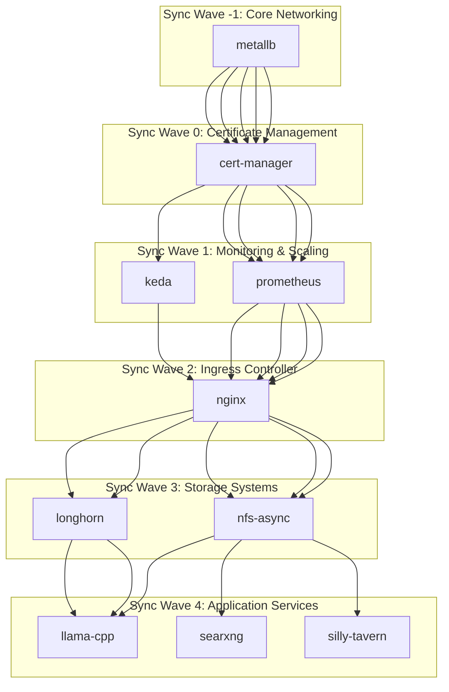

# Kubernetes Infrastructure as Code

This repository contains infrastructure-as-code (IaC) configurations for deploying and managing a Kubernetes cluster using **ArgoCD**, **Crossplane**, **SOPS**, and **Helm**. It is designed to automate the provisioning of control planes, node groups, storage, networking, and application services.

---

## 📁 Directory Structure

- **`.gitignore`**: Excludes sensitive files and IDE artifacts.
- **`bootstrap/argocd/devops/`**: Contains ArgoCD Application manifests for cluster components (control plane, CPU/GPU nodes, etc.):
  - `main.yaml`: Main cluster definition
  - `control-plane.yaml`: Control plane node definitions
  - `cpu-static.yaml`: Static CPU worker node deployments
  - `gpu-autoscaler.yaml`: GPU worker node deployments with autoscaling
  - `storage-static.yaml`: Static storage worker node deployments
- **`charts/`**: Helm charts for deploying applications and services:
  - `llama-cpp/`: LLM inference service chart
- **`devops/argocd/`**: ArgoCD Application manifests for services like Prometheus, Rook, MetalLB, and secrets.
- **`manual/argocd/`**: Manual overrides for cluster-specific configurations.
- **`scripts/`**: Shell scripts for SOPS encryption/decryption and key initialization.
- **`scripts/decrypt.sh` / `scripts/encrypt.sh`**: Automate secret management with SOPS.
- **`scripts/init.sh`**: Initializes the SOPS age key secret in Kubernetes.

---

## 🛠️ Getting Started

1. **Prerequisites**
   - `kubectl`
   - `argo` CLI
   - `sops` (for secret management)
   - `helm` (for Crossplane/MinIO)
   - `argocd` CLI (for ArgoCD management)

2. **Initialize the Cluster**
   ```bash
   # Initialize SOPS key
   ./scripts/init.sh

   # Decrypt secrets (if needed)
   ./scripts/decrypt.sh

   # Apply ArgoCD Applications
   kubectl apply -f bootstrap/init.yaml
   ```

3. **Verify Deployment**
   ```bash
   kubectl get applications -n argocd
   ```

4. **Sync Applications**
   ```bash
   # Sync all applications in order (using sync waves)
   argocd app sync --all
   ```

---

## 🔐 Secret Management

- Secrets are encrypted using **SOPS** and stored in `devops/argocd/secrets/enc.*.yaml`.
- Decryption is handled by `scripts/decrypt.sh`, which uses the age key mounted at `/etc/sops-age-key-file`.

---

## 📌 Notes

- Replace placeholder values in `charts/minio-crossplane/values.yaml` with your actual MinIO endpoint and credentials.
- Ensure the control plane IP in `bootstrap/argocd/devops/main.yaml` matches your environment.
- GPU/CPU node groups are defined in `bootstrap/argocd/devops/gpu.yaml` and `bootstrap/argocd/devops/cpu.yaml`.
- ArgoCD applications are ordered using sync waves to ensure proper deployment sequence:
  - Wave -1: Core networking components (MetalLB)
  - Wave 0: Certificate management (cert-manager)
  - Wave 1: Monitoring (Prometheus, KEDA)
  - Wave 2: Ingress controller (nginx)
  - Wave 3: Storage systems (Longhorn, NFS)
  - Wave 4: Application services (searxng, silly-tavern, llama-cpp, etc.)

---

## 🧩 Contributing

- Add new ArgoCD Applications to `devops/argocd/`.
- Add new Helm charts to `charts/`.
- Add manual overrides to `manual/argocd/` if needed.
- Always encrypt secrets before committing.
- When adding new ArgoCD applications, assign appropriate sync waves to ensure proper deployment order.

## 🔄 Sync Waves Diagram

Below is a visual representation of how the applications are synchronized using ArgoCD sync waves:

