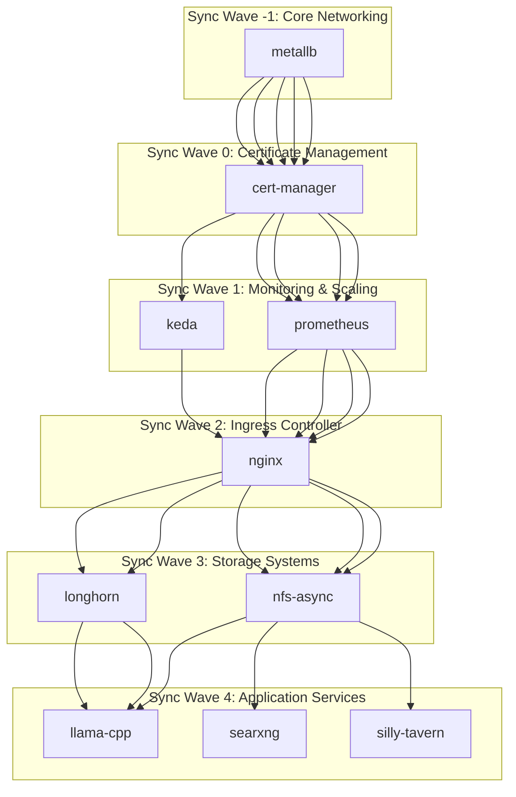

# ArgoCD Sync Waves Diagram

This diagram shows the synchronization order of applications in the devops-cluster using ArgoCD sync waves.

```mermaid
graph TD
    subgraph "Sync Wave -1: Core Networking"
        A[metallb]
    end
    
    subgraph "Sync Wave 0: Certificate Management"
        B[cert-manager]
    end
    
    subgraph "Sync Wave 1: Monitoring & Scaling"
        C[keda]
        D[prometheus]
    end
    
    subgraph "Sync Wave 2: Ingress Controller"
        E[nginx]
    end
    
    subgraph "Sync Wave 3: Storage Systems"
        F[longhorn]
        G[nfs-async]
    end
    
    subgraph "Sync Wave 4: Application Services"
        H[llama-cpp]
        I[searxng]
        J[silly-tavern]
    end
    
    A --> B --> C --> E --> F --> H
    A --> B --> D --> E --> F --> H
    A --> B --> D --> E --> G --> H
    A --> B --> D --> E --> G --> I
    A --> B --> D --> E --> G --> J
```