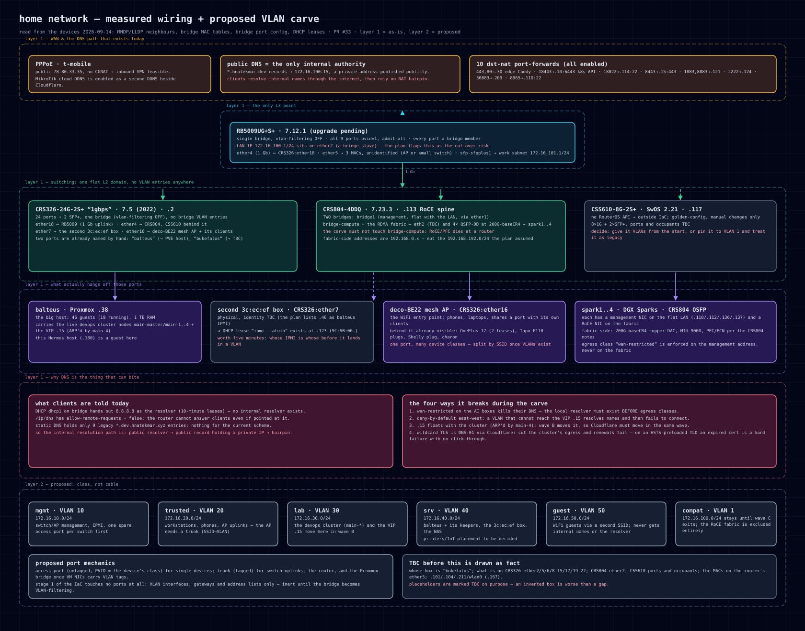

# Network wiring — measured, plus the proposed VLAN carve

**Sources (read from the devices, 2026-09-14 — not from memory or the plan):** MNDP/LLDP
neighbour tables, bridge MAC tables (`/interface/bridge/host`), bridge port configuration,
DHCP leases, `/ip/dns`, `/ip/firewall/nat`. Everything below is either **measured** or
explicitly marked **TBC**; an invented box would be worse than a gap.

## Layer 1 — as it is

| Element | Measured |
|---|---|
| **RB5009** (`172.16.100.1`, 7.12.1) | One bridge, `vlan-filtering` **OFF**, all 9 ports `pvid=1, frame-types=admit-all`, **no bridge VLAN entries**. LAN IP `172.16.100.1/24` sits on **`ether2`** (a bridge slave) — the cut-over risk the plan already flags. `ether4` (1 Gb) ↔ CRS326 `ether18`; `ether5` carries 3 MACs (AP or small switch, TBC); `sfp-sfpplus1` = the work subnet `172.16.101.1/24` |
| **CRS326-24G-2S+** (`172.16.100.2`, **7.5** from 2022, "1gbps") | 24 ports + 2 SFP+, one bridge, same flat posture. `ether18` ↔ router; `ether4` → CRS804 (CSS610 behind it); `ether7` → the second `3c:ec:ef` box; `ether16` → **deco-BE22** mesh AP + its clients. Two ports are already named by hand: **`balteus`** and **`bukefalos`** |
| **CRS804-4DDQ** (`172.16.100.113`, 7.23.3) | **Two bridges**: `bridge1` (management, flat with the LAN, `ether1`) and **`bridge-compute`** — the RDMA fabric: 4× QSFP-DD at `200G-baseCR4` → spark1..4, MTU 9000 with PFC/ECN. **The carve must not touch `bridge-compute`**: RoCE/PFC does not survive a router |
| **CSS610-8G-2S+** (`172.16.100.117`, SwOS 2.21) | No RouterOS API → outside IaC. Occupants TBC (LLDP sees the device, not its ports) |
| **Endpoints** | `balteus` (Proxmox, 46 guests, 19 running) carries the live devops cluster `main-*` and the **VIP `.15`** (ARP'd by `main-4`); the Sparks each have a management NIC on the flat LAN (`172.16.100.110/112/136/137`) **and** a RoCE NIC on the fabric (`192.168.0.x` — note: **not** the `192.168.192.0/24` the plan assumes) |

### Corrections this pass produced

1. The Sparks' fabric-side addressing is **`192.168.0.x`**, not `192.168.192.0/24`.
2. The RB5009's uplink to the main switch is **1 Gb** (`ether4`↔`ether18`); the 10 G SFP+ goes to the *work* subnet instead.
3. CRS326 already carries **hand-named ports** (`balteus`, `bukefalos`) — the class intent is partly expressed on the device already.
4. The RoCE fabric lives on a **separate bridge** on the CRS804 (`bridge-compute`), so "leave the fabric alone" is a per-bridge decision, not per-port.

## Layer 2 — proposed, for review

**The model, because it is easy to misread:** VLAN membership is decided by **device class**
(what the device may reach), never by which socket it happens to use. The port is only the
*mechanism* — an access port (untagged, PVID = the class) for a single device, a trunk
(tagged) for switch uplinks, the router, and the Proxmox bridge once VM NICs carry tags.
Stage 1 of the IaC touches **no ports at all** — VLAN interfaces, gateways and address lists
only, inert until the bridge becomes VLAN-filtering.

| Class | Subnet | Candidates from the measurements |
|---|---|---|
| mgmt | `172.16.10.0/24` | switch/AP management, IPMI — one spare access port per switch first (wave A) |
| trusted | `172.16.20.0/24` | workstations, phones, the AP uplink (needs a **trunk**: SSID → VLAN) |
| lab | `172.16.30.0/24` | the devops cluster `main-*` **and the VIP `.15`** (wave B moves both) |
| srv | `172.16.40.0/24` | `balteus` + its keepers, the `3c:ec:ef` box, the NAS |
| guest | `172.16.50.0/24` | guest WiFi via a second SSID — no internal names, no internal resolver |
| compat | VLAN 1, `172.16.100.0/24` | stays until wave C exits; **fabric excluded entirely** |

## Why the DNS ordering matters (the risk that outranks the VLANs)

| Measured today | Consequence |
|---|---|
| DHCP hands out **`8.8.8.8`** (`/ip/dhcp-server/network`, 10-minute leases) | Every client resolves *internal* names through the public internet |
| `.dev` records on Cloudflare point at the **private** `172.16.100.15` | It works only because public DNS returns a private IP, plus NAT hairpin |
| **`allow-remote-requests: false`** | The router cannot serve DNS to clients even if they were pointed at it |
| Only 9 legacy `*.dev.hnatekmar.xyz` static entries | No authority exists for the current scheme |
| `.15` is ARP'd by `main-4` | When the cluster moves to the lab VLAN the VIP moves with it → Cloudflare must move in the same wave |
| Wildcard TLS is **DNS-01 → Cloudflare**, `.dev` is HSTS-preloaded | Cut the cluster's egress and renewals fail; an expired cert on an HSTS TLD is a hard failure, no click-through |

Four ways this bites during a carve: (1) `wan-restricted` on the AI boxes kills their DNS —
the local resolver must exist **before** egress classes; (2) deny-by-default east-west means
a VLAN that cannot reach `.15` resolves names and then fails to connect, which reads as "DNS
is broken" but is not; (3) the VIP moves with the cluster mid-wave; (4) cert renewal depends
on the same path being intact.

**Therefore the step order is: DNS independence first (additive) → VLAN waves → egress
classes last.**

## TBC — needed before this is drawn as fact

- Whose box is **`bukefalos`**?
- **CRS326 `ether2/5/6/8–15/17/19–22`** — genuinely empty, or occupied by things that do not speak LLDP?
- **CRS804 `ether2`** — up, no neighbours.
- **CSS610** ports and occupants (SwOS: needs the UI or a neighbour-side LLDP dump).
- The three MACs on the router's **`ether5`**; and `.101`, `.104`, `.211`, `wlan0` (`.167`).
- **IoT/printers**: own VLAN, or the plan's "onto `.40`"? It changes how many access ports the carve needs.
